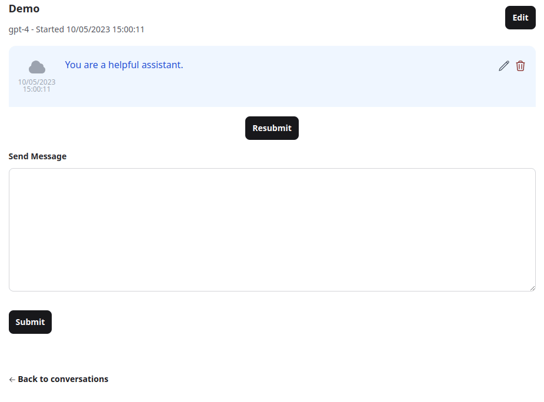
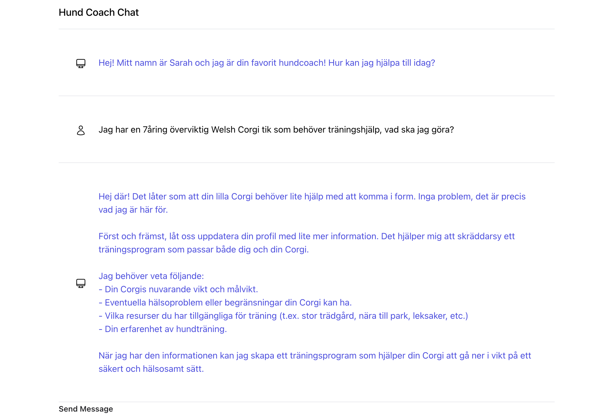

#  My Elixir AI personal assistent

This project is my playaround project on the langchain_demo project using the [Elixir LangChain](https://github.com/brainlid/langchain) library and [Phoenix LiveView](https://www.phoenixframework.org/).

To start your own Elixir AI personal assistent project:

  * Run `mix setup` to install and setup dependencies
  * Setup your `export OPENAI_API_KEY=`, you can find more [here](https://platform.openai.com/docs/quickstart/step-2-setup-your-api-key) *(Also make sure you have some $$ for tokens, lagnchain creates really hard errors if you miss that.)*

  * Start Phoenix endpoint with `mix phx.server` or inside IEx with `iex -S mix phx.server`

Now you can visit [`localhost:4400`](http://localhost:4400) from your browser.

## Conversations

Visit the [Conversations](http://localhost:4400/conversations) page for having a conversation with ChatGPT.

You can cancel a request in flight, delete a message, edit a message, and resubmit the conversation.

Features:
- Conversations are written to a SQLite database in the project directory.
- Conversations are performed using the [Elixir LangChain](https://github.com/brainlid/langchain) library.
- Uses Phoenix LiveView [Async Operations](https://hexdocs.pm/phoenix_live_view/Phoenix.LiveView.html#module-async-operations).
- Use <kbd>ctrl+enter</kbd> to submit a message.

## Dog Coach (only i swedish atm)

Dog coachen is using An [Agent](https://python.langchain.com/docs/modules/agents/) can be sortly described as:

> **Agent**: a language model is used as a reasoning engine to determine which actions to take and in which order.

Visit the [Dog Coach](http://localhost:4400/dog_coach) page to meet with your own Dog coach that really loves dog.

Suggestion: Tell a bit about you dog and ask "hur kan jag förbättra vovves hälsa?" to get started and go from there!

Example:

Features:
- Context around how the AI is configured is hidden from the user.
- Data about the user is written in a structured format by the AI into a local SQLite database.
- Historical fitness log entries are stored and fetched from the local database.
- Provides a simple but powerful working example of how to create an AI agent in Elixir that integrates with your app.

## Future Features:
- renovation-helper keep track of all projects, and help where needed
- yoga trainer, as the normal trainer but yoga, can you integrate video support?
- add lang-support(sv + en)
